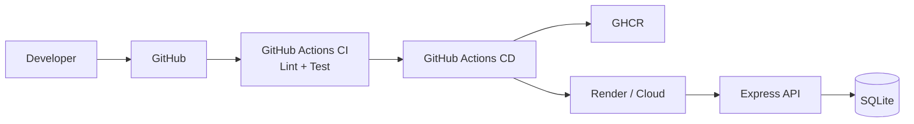

# DevOps Todo API

REST API quan ly cong viec, duoc xay dung cho bai tap ca nhan DevOps Node.js.

## Cong nghe

- Node.js 20 + Express
- SQLite voi `sql.js` (WebAssembly, khong can native compiler)
- Docker multi-stage va Docker Compose
- Jest + Supertest + ESLint
- GitHub Actions CI/CD
- Render Blueprint (tuy chon deploy)
- Prometheus metrics tai `/metrics`

## Chay local

```bash
cp .env.example .env
npm install
npm run lint
npm test
npm start
```

API mac dinh tai `http://localhost:3000`.

## API endpoints

- `GET /health`: health check
- `GET /metrics`: metrics cho Prometheus
- `GET /api/todos`: lay danh sach
- `GET /api/todos/:id`: lay mot todo
- `POST /api/todos`: tao todo, body `{ "title": "Learn CI/CD" }`
- `PUT /api/todos/:id`: cap nhat, body `{ "title": "...", "completed": true }`
- `DELETE /api/todos/:id`: xoa todo

## Chay bang Docker

```bash
docker compose up --build
```

## CI/CD

- `ci.yml` chay khi push hoac pull request: cai dependency, lint va test coverage.
- `cd.yml` chi chay khi push vao `main`: build image va push len GitHub Container Registry.
- `ci.yml` chay `npm audit` va Trivy filesystem scan de phat hien dependency/image risk.
- `rollback.yml` cho phep rollback Render thu cong voi `RENDER_API_KEY`, `RENDER_SERVICE_ID` va deploy ID.
- `render.yaml` co production (`main`) va staging (`develop`) tach biet.
- Tao GitHub secret `RENDER_DEPLOY_HOOK` neu dung Render Deploy Hook.
- GitHub Container Registry su dung tu dong `GITHUB_TOKEN`.

Khong commit `.env`, database hoac credential. Chi commit `.env.example`.

## Bao cao ca nhan

Bo sung ho ten, ma so hoc vien, lop, link GitHub, link app deploy va video demo vao bao cao. Khi quay video, nen the hien: push code, CI xanh, CD build/push image va app tra ve `/health`.

## So do kien truc


